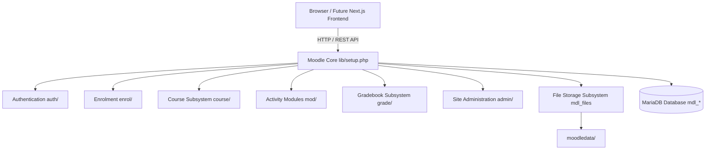
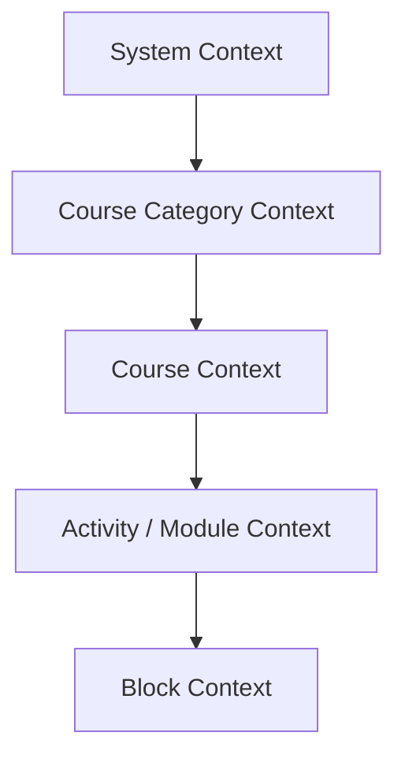
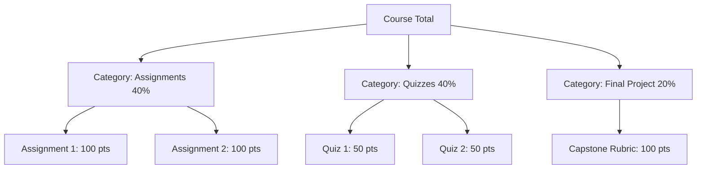
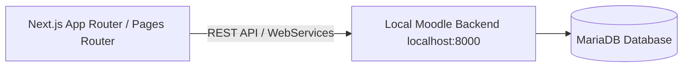

# Moodle Product Architecture, Functional Specification & Frontend Analysis

**Target System:** Moodle 4.1 LTS Enterprise Learning Management System  
**Local Environment Instance:** `http://localhost:8000`  
**Core Version:** `4.1.22+ (Build: 20251212)` | **Branch:** `401` | **Database:** MariaDB (`mdl_` prefix)  
**Deliverable Type:** Complete Functional Decomposition, Screen-by-Screen Specification & Next.js Modernization Blueprint  

> [!IMPORTANT]
> **Product Scope & Phase Execution Notice:**  
> This specification is strictly focused on the **Moodle product running on `http://localhost:8000`**. It documents all native modules, activity engines, user roles, administrative governance tools, and user journeys provided by this installation. The Next.js click-through implementation is intentionally deferred to the subsequent phase and will be built directly from the screen inventory and API mappings detailed in this document.

---

## Table of Contents

1. [Executive Summary & Local System Profile](#1-executive-summary--local-system-profile)
2. [Moodle Core Architecture & Subsystem Model](#2-moodle-core-architecture--subsystem-model)
3. [User Roles & Capability-Based Access Control (RBAC)](#3-user-roles--capability-based-access-control-rbac)
4. [Authentication & Session Governance](#4-authentication--session-governance)
5. [Student / Learner Experience & Core Workflows](#5-student--learner-experience--core-workflows)
6. [Instructor & Course Authoring Tooling](#6-instructor--course-authoring-tooling)
7. [Comprehensive Activity & Resource Modules](#7-comprehensive-activity--resource-modules)
   - 7.1 Assignment Module (`mod_assign`)
   - 7.2 Quiz Engine & Question Bank (`mod_quiz`)
   - 7.3 Interactive Multimedia & Content Bank (`mod_h5pactivity`)
   - 7.4 Collaborative Forum Discussions (`mod_forum`)
   - 7.5 Structured Study Modules (`mod_book`, `mod_lesson`, `mod_page`)
   - 7.6 Virtual Classroom & Synchronous Learning (`mod_bigbluebuttonbn`, `mod_chat`)
   - 7.7 Advanced Peer Review & Data Gathering (`mod_workshop`, `mod_data`, `mod_feedback`)
   - 7.8 Standard Packages & External Interoperability (`mod_scorm`, `mod_lti`)
8. [Gradebook, Assessment & Progress Tracking Architecture](#8-gradebook-assessment--progress-tracking-architecture)
9. [Enrolment & Cohort Management Subsystem](#9-enrolment--cohort-management-subsystem)
10. [Site Administration & Platform Governance](#10-site-administration--platform-governance)
11. [Screen-by-Screen Analysis & UI Evidence](#11-screen-by-screen-analysis--ui-evidence)
12. [Navigation & Layout Architecture](#12-navigation--layout-architecture)
13. [Component-Level Inventory & UI States](#13-component-level-inventory--ui-states)
14. [End-to-End User Journeys](#14-end-to-end-user-journeys)
15. [Modernization Blueprint for Future Next.js Frontend](#15-modernization-blueprint-for-future-nextjs-frontend)
16. [Conclusion](#16-conclusion)

---

## 1. Executive Summary & Local System Profile

The system under analysis is a production-grade deployment of **Moodle 4.1 LTS (Long Term Support)** running locally at `http://localhost:8000`. Moodle is the world's most widely deployed open-source learning management system, providing a robust, modular, and socially constructive learning environment.

### 1.1 Local Deployment Profile

```text
Host URL:              http://localhost:8000
Document Root:         D:\projects\moodle
Data Root (moodledata): D:\projects\moodledata
Moodle Version:        4.1.22+ (Build: 20251212)
Branch / Maturity:     MOODLE_401_STABLE / MATURITY_STABLE
PHP Environment:       PHP 8.0.30 (cli) / Zend Engine v4.0.30
Database Engine:       MariaDB 10.4.x (InnoDB, utf8mb4_unicode_ci collation)
Database Name:         moodle (Table Prefix: mdl_)
Active Theme:          theme_boost (Bootstrap 4/5 responsive drawer architecture)
Cache Store:           Local file cache (moodledata/cache) with Redis/Memcached hooks
Administrative User:   admin (Full Site Administrator privileges)
```

### 1.2 Primary Architectural Strengths
- **Unrivaled Assessment Depth:** A quiz engine supporting over 15 question types, calculated variables, question banks with category tagging, and automated or manual grading.
- **Granular Activity Completion:** Courses can mandate precise completion criteria (e.g. "Student must view", "Student must achieve passing grade", "Student must submit").
- **Flexible Enrolment Framework:** Supports manual assignment, self-enrolment with enrolment keys, cohort synchronization, PayPal payments, and external LDAP/database feeds.
- **Multi-Role RBAC Model:** A capability-based security model containing over 1,000 distinct permissions mapped to system, category, course, and module contexts.

---

## 2. Moodle Core Architecture & Subsystem Model



Moodle's architecture is organized into clean, modular plugins where every major capability is isolated into a dedicated subsystem:

| Subsystem Directory | Subsystem Name | Responsibility in Local Instance |
| :--- | :--- | :--- |
| `mod/` | Activity Modules | 24 interactive learning activities and resources (Assign, Quiz, Book, Forum, H5P, BigBlueButton, Lesson, Workshop, etc.). |
| `blocks/` | Dashboard & Course Blocks | 38 modular widgets (Course Overview, Timeline Deadlines, Calendar, Recently Accessed, Online Users, Badges). |
| `enrol/` | Enrolment Plugins | 12 enrolment drivers (Manual, Self, Cohort Sync, Guest, PayPal, Meta Links, LTI). |
| `grade/` | Gradebook Engine | Multi-report grade calculation, letter grade scales, grade categories, grader report, and grade history audit trail. |
| `report/` | Reporting Subsystem | Course completion, activity participation, security logs, live activity logs, and predictive learning analytics. |
| `theme/` | Presentation Layer | `theme_boost` providing collapsible navigation drawers, mobile-responsive layout, and Mustache template rendering. |
| `admin/tool/` | Administrative Tools | Upload users via CSV, task scheduler (cron), database integrity check, data privacy management, and backup/restore. |
| `webservice/` | Web Services & REST API | Token-based REST, GraphQL, and Mobile App endpoints enabling headless frontend integration. |

---

## 3. User Roles & Capability-Based Access Control (RBAC)

Moodle does not use simple static role tags; it utilizes an enterprise **Context Hierarchy**:

$$\text{System} \longrightarrow \text{Course Category} \longrightarrow \text{Course} \longrightarrow \text{Activity / Module} \longrightarrow \text{Block}$$

A user can be an **Instructor** in Course A, a **Student** in Course B, and a **Manager** at the Category level.



### 3.1 The 8 Standard Roles in the Local System

| Role Name | System Shortname | Context Level | Core Capabilities & Permissions |
| :--- | :--- | :--- | :--- |
| **Site Administrator** | `admin` | Global System | Unrestricted control. Can modify server configurations, install plugins, access database tables, manage all users, and override any permission. |
| **Manager** | `manager` | System / Category | Institutional coordinator. Can create courses, assign teachers, organize cohorts, view sitewide completion reports, but cannot alter server infrastructure. |
| **Course Creator** | `coursecreator` | System / Category | Authoring lead. Can create new courses within designated categories and automatically becomes the Editing Teacher of created courses. |
| **Teacher (Editing)** | `editingteacher` | Course | Full instructional control. Can add/remove activities, configure gradebook weightings, edit course layout, grade submissions, and manage enrollments. |
| **Non-editing Teacher** | `teacher` | Course / TA | Teaching Assistant role. Can view student work, grade assignments, moderate forums, but cannot add new activities or alter course settings. |
| **Student / Learner** | `student` | Course | Primary learner role. Can access published activities, watch videos, submit assignments, attempt quizzes, participate in forums, and view personal grades. |
| **Guest** | `guest` | Course | Read-only visitor. Can browse course syllabi and public resources if enabled, but cannot submit coursework, attempt quizzes, or post in forums. |
| **Authenticated User** | `user` | System | Base role granted to every logged-in account. Governs profile management, personal private files, and site-wide messaging. |

---

## 4. Authentication & Session Governance

The local Moodle instance provides robust authentication workflows managed via `auth/`:

### 4.1 Login Flow (`/login/index.php`)
- **Username / Email Authentication:** Validates against `mdl_user` table using bcrypt hashing (`password_hash`).
- **Internal Test/Admin Access:** Provided for local testing environments; credentials must remain strictly separate from client bundles.
- **Session Architecture:** Moodle writes a secure PHP session cookie (`MoodleSession`) to track the authenticated user across requests.
- **Guest Access:** Direct button on the login screen (`Access as a guest`) that grants temporary `guest` role credentials without requiring database registration.
- **Cookies Notice Modal:** Accessible directly from the login footer detailing session and privacy cookie policies.

### 4.2 Account Recovery (`/login/forgot_password.php`)
- Users enter their registered username or email address.
- Moodle generates a cryptographic one-time token stored in `mdl_user_preferences` with a 30-minute validity window.
- Sends an automated email containing a direct password reset URL (`/login/change_password.php?token=...`).

---

## 5. Student / Learner Experience & Core Workflows

The learner interface is optimized for focused study, deadline awareness, and clear progress visibility.

```text
Learner Journey Map
Login (/login/index.php)
  ↓
Student Dashboard (/my/)
  ├── "Course Overview" with progress meters (e.g. 75% completed)
  ├── "Timeline Block" showing upcoming deadlines (Due in 3 days)
  └── "Recently Accessed Items" for 1-click lesson resume
  ↓
Course Page (/course/view.php?id=X)
  ├── Left Course Index Drawer (Jump between sections)
  ├── Section 1: Lecture Notes & PDF Reading
  ├── Section 2: Interactive Video Lecture (H5P / Video.js)
  └── Section 3: Graded Knowledge Check (Quiz)
  ↓
Quiz Attempt (/mod/quiz/view.php)
  ├── Review attempt rules & countdown timer
  ├── Answer multiple-choice & short answer questions
  └── Submit all and view immediate automated scorecard
  ↓
Personal Grades & Certificates (/grade/report/overview/ & /badges/)
```

### 5.1 Student Dashboard (`/my/`)
- **Course Overview Block:** Grid, list, or summary cards of enrolled courses. Includes progress bars, completion percentages, and status filters: *All*, *In progress*, *Future*, *Past*, *Starred*, and *Removed from view*.
- **Timeline Block:** Chronological listing of upcoming action items. Sortable by *Due dates* (Next 7 days, 30 days, 3 months) or *Courses*.
- **Recently Accessed Items:** Horizontal carousel displaying the exact activities the student was working on last.
- **Calendar Block:** Color-coded calendar showing course deadlines, institutional holidays, and group events.

### 5.2 Course Outline & Navigation (`/course/view.php`)
- **Collapsible Course Index (Left Drawer):** Allows learners to jump instantly between topics/weeks without losing their page scroll.
- **Activity Completion Badges:**
  - `To do`: Gray badge indicating unfulfilled requirements.
  - `Done`: Green checkmark badge confirming automated verification (e.g. "Received passing grade").
- **Activity Cards:** Clear distinction between resources (Files, Books, URLs) and interactive activities (Quizzes, Assignments, Forums).

---

## 6. Instructor & Course Authoring Tooling

Instructors possess comprehensive authoring, assessment, and communication tools.

### 6.1 Course Editing Mode (`/course/view.php?id=X&edit=on`)
- A prominent toggle switch in the top header activates **Edit Mode**.
- **Drag-and-Drop Reordering:** Sections and individual activities can be dragged and repositioned dynamically.
- **"Add an activity or resource" Modal:** Tabbed dialog categorized by *All*, *Activities*, and *Resources*, featuring search and bookmarking.

### 6.2 SpeedGrader & Assignment Evaluation (`/mod/assign/view.php?id=X&action=grading`)
- **Submissions Table:** Displays student names, submission status (*Submitted for grading*, *Draft*, *Overdue*), submission timestamps, file attachments, and grade values.
- **Split-Screen Grading Interface:**
  - Left pane: Integrated PDF/Document document previewer with annotation pens, highlighters, and sticky notes.
  - Right pane: Numeric grade input, custom grading rubric matrix, private instructor notes, and rich feedback comments.
  - Quick action: "Notify students" toggle to send email notifications upon grade publication.

### 6.3 Course Participants Management (`/user/index.php?id=X`)
- Roster showing all enrolled learners and co-teachers.
- Search and filter by *Role*, *Enrolment method*, *Active status*, and *Group*.
- Manual enrolment button allows instructors to enroll users by name or email with custom role assignments.

---

## 7. Comprehensive Activity & Resource Modules

The local Moodle installation includes 24 activity and resource modules in `d:\projects\moodle\mod`:

### 7.1 Assignment Module (`mod_assign`)
- **Submission Types:** Online rich text editor with word limits, file submissions (PDF, ZIP, DOCX, code) with file size caps and maximum file counts.
- **Feedback Types:** Feedback comments, annotated PDF documents, feedback files, offline grading worksheets.
- **Grading Methods:** Simple direct grading (0–100), Marking guides, and Multi-criteria Rubrics.
- **Submission Settings:** Group submission mode (team projects), blind grading (student identities hidden until grades published), submission statements (academic honesty declarations).

### 7.2 Quiz Engine & Question Bank (`mod_quiz`)
- **Question Types Supported:**
  - Multiple Choice (Single or multiple answers allowed).
  - True/False.
  - Short Answer (case-sensitive or insensitive regex).
  - Numerical (with allowed error tolerances and unit multipliers).
  - Calculated & Calculated Multi-choice (randomized variables per student).
  - Essay (manually graded rich text or file attachment).
  - Matching & Drag-and-drop into text / onto image.
  - Select missing words.
- **Quiz Behaviors:** Immediate feedback with CBM (Certainty-based marking), Deferred feedback, Interactive with multiple tries, Adaptive mode (penalty per wrong attempt).
- **Exam Security:** Time limits with live countdown timer, open/close date windows, browser security modes (Safe Exam Browser hooks), password protection, subnet IP restrictions.

### 7.3 Interactive Multimedia & Content Bank (`mod_h5pactivity`)
- Native H5P player and editor integrated directly into core Moodle.
- **Content Types:** Interactive Videos with in-video questions, Branching Scenarios, Course Presentations, Flashcards, Virtual 360 Tours.
- **Content Bank (`/contentbank/`):** Centralized repository where instructors create, store, edit, and reuse H5P packages across multiple courses.
- **Grading:** Automatic score passback into the Moodle Gradebook based on H5P internal question outcomes.

### 7.4 Collaborative Forum Discussions (`mod_forum`)
- **Forum Types:**
  - Standard forum for general use.
  - Single simple discussion (focused single topic).
  - Q&A Forum (students must post their answer before viewing peers' answers).
  - Each person posts one discussion.
- **Features:** Threaded discussions, inline rich text replies, file attachments, email digest subscriptions, RSS feeds, instructor post pinning, and peer rating scales (Average, Count, Maximum, Minimum, Sum of ratings).

### 7.5 Structured Study Modules (`mod_book`, `mod_lesson`, `mod_page`)
- **Book Module (`mod_book`):** Multi-page linear study material organized into numbered chapters and subchapters with print options.
- **Lesson Module (`mod_lesson`):** Adaptive, branching learning path. Displays content followed by questions; learner's answer determines which page they advance to next.
- **Page Module (`mod_page`):** Single clean web page embedding text, images, and audio/video players.

### 7.6 Virtual Classroom & Synchronous Learning (`mod_bigbluebuttonbn`, `mod_chat`)
- **BigBlueButton (`mod_bigbluebuttonbn`):** Built-in open-source virtual classroom providing live video/audio conferencing, interactive whiteboard, multi-user breakout rooms, screen sharing, and automatic session recording.
- **Chat (`mod_chat`):** Lightweight, real-time synchronous text chat for office hours and study groups.

### 7.7 Advanced Peer Review & Data Gathering (`mod_workshop`, `mod_data`, `mod_feedback`)
- **Workshop (`mod_workshop`):** Powerful peer assessment activity operating across 5 distinct phases: *Setup*, *Submission*, *Assessment* (peers grade each other using rubrics), *Grading Evaluation*, and *Closed*.
- **Database (`mod_data`):** Custom database builder allowing classes to co-create collections of research articles, book reviews, or lab data.
- **Feedback (`mod_feedback`):** Form builder for student feedback surveys, course evaluations, and anonymous institutional polling.

### 7.8 Standard Packages & External Interoperability (`mod_scorm`, `mod_lti`)
- **SCORM Player (`mod_scorm`):** Full compliance with SCORM 1.2 and AICC packages, tracking lesson status, time spent, and mastery scores.
- **External Tool (`mod_lti`):** Compliant with 1EdTech LTI 1.1 / 1.3 / Advantage standards, embedding third-party educational tools seamlessly with grade sync.

---

## 8. Gradebook, Assessment & Progress Tracking Architecture

Moodle's gradebook (`grade/`) is an industrial-strength calculation engine:



### 8.1 Grade Aggregation Methods
- **Natural:** Sum of all grade values with automatic weighting proportional to max points.
- **Simple Weighted Mean:** Grades multiplied by item weights.
- **Weighted Mean of Grades:** Custom category weights (e.g. Category A = 40%, Category B = 60%).
- **Drop Lowest:** Automatically discards the lowest $N$ quiz scores from the final calculation.

### 8.2 Primary Gradebook Reports
1. **Grader Report (`/grade/report/grader/index.php`):** Two-dimensional spreadsheet showing all students across all graded activities. Supports quick inline editing, grade freezing, and grade hiding.
2. **User Report (`/grade/report/user/index.php`):** Personalized student view detailing score, percentage, letter grade, ranking, and teacher feedback comments.
3. **Overview Report (`/grade/report/overview/index.php`):** High-level summary of a student's final standing across every enrolled course.
4. **Grade History (`/grade/report/history/index.php`):** Complete immutable audit log showing original grade, modified grade, who made the edit, and timestamp.

---

## 9. Enrolment & Cohort Management Subsystem

Moodle handles student registration through its pluggable `enrol/` architecture:

```text
Enrolment Drivers in Local System
├── Manual Enrolment (Instructor or Admin directly assigns users)
├── Self Enrolment (Student clicks "Enrol me", optional password/key)
├── Cohort Sync (Auto-enrols all members of a department/class cohort)
├── Guest Access (Allows anonymous access without database records)
├── PayPal / Fee Payment (Instant enrollment upon successful payment)
└── Course Meta Link (Synchronizes enrollments from a parent course)
```

- **Cohorts (`/cohort/index.php`):** Sitewide or category-wide groupings of users (e.g. "Batch 2026", "Computer Science Dept"). Assigning a cohort to a course enrols all 500 members in one click; adding a user to the cohort automatically enrols them into all assigned courses.

---

## 10. Site Administration & Platform Governance

The Site Administration hub (`/admin/search.php`) is the command center for the entire platform:

```text
Site Administration Structure
│
├── Users Tab
│   ├── Accounts: Browse list of users, Add a new user, Bulk user actions, User profile fields
│   ├── Permissions: Define roles, Assign system roles, Check system permissions
│   └── Privacy & Policies: Data retention summary, Site policy agreement
│
├── Courses Tab
│   ├── Course & Category Management: Manage categories, Create courses, Sort courses
│   ├── Backups: Automated course backup schedules, Course restore tools
│   └── Default Settings: Course formats (Topics, Weekly), Activity defaults
│
├── Grades Tab
│   ├── General settings: Grade display types (Real, Percentage, Letter), Grade point limits
│   └── Scales & Letters: Custom letter boundaries (A = 90%, B = 80%), Qualitative scales
│
├── Plugins Tab
│   ├── Activity Modules: Enable/disable activities, Configure quiz & assignment defaults
│   ├── Enrolment: Configure payment gateways, LDAP mappings, self-enrolment defaults
│   └── Repositories: Enable Google Drive, OneDrive, Wikimedia, Private files
│
├── Server Tab
│   ├── Environment: PHP version verification, Database performance checks
│   ├── Scheduled Tasks: Cron job monitoring (Adhoc tasks, Automated backups)
│   └── Performance: Caching stores (Redis/Memcached), Session drivers
│
└── Reports Tab
    ├── System Logs: Full historical logs with IP address and event name
    ├── Security: Security checklist, Configuration change log
    └── Insights: Machine learning predictive analytics models
```

---

## 11. Screen-by-Screen Analysis & UI Evidence

Below is the verified screen-by-screen breakdown of all core screens in our running Moodle product, linked to our captured screenshot evidence:

### SCR-01: Login Screen (`/login/index.php`)
* **Role:** Unauthenticated Visitor / All Users
* **Screenshot:** 
* **Purpose:** Authenticate users into their respective role dashboards.
* **UI Structure:** Centered card with system title ("Moodle Local"), Username input, Password input, Primary "Log in" button, "Lost password?" link, Divider line, "Access as a guest" secondary button, and "Cookies notice" modal trigger.
* **States:** Default, Loading (form disable), Error (Red banner: "Invalid login, please try again").

### SCR-02: Student Dashboard (`/my/`)
* **Role:** Student / Learner
* **Screenshot:** 
* **Purpose:** High-level personal learning cockpit.
* **UI Structure:** Welcome banner, "Recently accessed items" row, "Course overview" card grid with progress meters, and right-hand block drawer containing Timeline (deadlines) and Calendar widgets.
* **User Actions:** Click course card to resume, click deadline item to jump directly to quiz/assignment, filter courses by progress.

### SCR-03: My Courses Grid (`/my/courses.php`)
* **Role:** Student / Teacher
* **Screenshot:** 
* **Purpose:** Dedicated repository of all enrolled courses.
* **UI Structure:** Top search bar for instant course filtering, Dropdown filters (*All*, *In progress*, *Future*, *Past*, *Starred*), Sort dropdown (*Last accessed*, *Title*), Card display with category pills, title, and progress percentage.

### SCR-04: Course Main Page (`/course/view.php?id=X`)
* **Role:** Student / Teacher
* **Screenshot:** 
* **Purpose:** Full course curriculum outline and activity launcher.
* **UI Structure:**
  - Left collapsible drawer: Course index tree with clickable sections and activities.
  - Center stage: Course sections (Topic 1, Topic 2), activity cards with icons, activity descriptions, and completion badges (`Done` / `To do`).
  - Right collapsible drawer: Block drawer (Latest announcements, Upcoming events).

### SCR-05: Quiz Activity Screen (`/mod/quiz/view.php`)
* **Role:** Student
* **Screenshot:** 
* **Purpose:** Assessment overview, rules display, and attempt launcher.
* **UI Structure:** Attempts allowed, Time limit banner, Grading method (*Highest grade*), Attempt history table showing previous scores and review links, and primary "Attempt quiz now" button.

### SCR-06: Forum Discussion (`/mod/forum/view.php`)
* **Role:** Student / Teacher
* **Screenshot:** 
* **Purpose:** Asynchronous group communication and Q&A.
* **UI Structure:** "Add discussion topic" button, Discussion table showing Subject, Started by (avatar + name), Replies count, and Last post timestamp. Thread view shows nested hierarchical replies with formatting.

### SCR-07: Calendar View (`/calendar/view.php?view=month`)
* **Role:** Student / Teacher
* **Screenshot:** 
* **Purpose:** Schedule governance and deadline tracking.
* **UI Structure:** Full monthly calendar grid, color-coded event pills (Green = Course, Blue = Site, Orange = User), Event category filter toggles, and "New event" action button.

### SCR-08: Student Grades Overview (`/grade/report/overview/index.php`)
* **Role:** Student
* **Screenshot:** 
* **Purpose:** Transcripts and cumulative performance review.
* **UI Structure:** Table listing all enrolled courses, current aggregate percentage score, letter grade, and direct links to full course grade breakdowns.

### SCR-09: User Profile (`/user/profile.php`)
* **Role:** Authenticated User
* **Screenshot:** 
* **Purpose:** Personal portfolio, bio, and activity summary.
* **UI Structure:** User avatar, email, country, course details list, miscellaneous links (Blog entries, Forum posts, Forum discussions), and Badges earned showcase.

### SCR-10: User Preferences (`/user/preferences.php`)
* **Role:** Authenticated User
* **Screenshot:** 
* **Purpose:** User account configurations.
* **UI Structure:** Sections for User account (Edit profile, Change password, Preferred language), Forum preferences (Email digest type, Auto-subscribe), Notification preferences, and Message settings.

### SCR-11: Course Catalogue (`/course/index.php`)
* **Role:** All Users
* **Screenshot:** 
* **Purpose:** Public and institutional course catalog browsing.
* **UI Structure:** Collapsible category hierarchy tree, course search input with auto-suggest, course cards with summaries, instructor names, and enrolment key icons.

### SCR-12: Teacher Course Participants (`/user/index.php?id=X`)
* **Role:** Teacher / Admin
* **Screenshot:** 
* **Purpose:** Student roster management and tracking.
* **UI Structure:** Search by name/ID, Role filter dropdown, Status filter, Data table with columns: First name / Last name, Email, Roles badge, Groups, Last access to course, and status toggle. "Enrol users" primary action button.

### SCR-13: Teacher Gradebook / Grader Report (`/grade/report/grader/index.php?id=X`)
* **Role:** Teacher / Admin
* **Screenshot:** 
* **Purpose:** Full grading spreadsheet matrix across all coursework.
* **UI Structure:** Students on rows, Graded activities across columns, Final Course Total column. Interactive cells with inline editing, override markers, and calculation formula configuration.

### SCR-14: Activity Completion Report (`/report/progress/index.php?course=X`)
* **Role:** Teacher / Admin
* **Screenshot:** 
* **Purpose:** Visual audit of student progress across mandatory milestones.
* **UI Structure:** Grid listing all students against all completion-enabled activities. Cells show checkmarks with date/time stamps confirming when criteria were met.

### SCR-15: Badges Management (`/badges/index.php?type=2&id=X`)
* **Role:** Teacher / Admin
* **Screenshot:** 
* **Purpose:** Gamification credentials and Open Badges criteria.
* **UI Structure:** Badge catalog, "Add a new badge" button, criteria configuration (Manual award by role, Course completion, Activity completion), badge issuer metadata, and status (*Available to users* / *Locked*).

### SCR-16: Site Administration Hub (`/admin/search.php`)
* **Role:** System Administrator
* **Screenshot:** 
* **Purpose:** Global platform configuration and monitoring.
* **UI Structure:** Primary search bar indexing all settings, Tabs for *General*, *Users*, *Courses*, *Grades*, *Plugins*, *Appearance*, *Server*, and *Reports*.

### SCR-17: Admin User Management (`/admin/user.php`)
* **Role:** System Administrator
* **Screenshot:** 
* **Purpose:** User directory lifecycle management.
* **UI Structure:** User search input, Advanced filter drawer (Email, City, Country, Confirmed, Suspended), User table with bulk selection checkboxes, Bulk actions dropdown (*Delete*, *Display on page*, *Download*, *Force password change*), and "Add a new user" button.

### SCR-18: Course & Category Governance (`/course/management.php`)
* **Role:** System Administrator / Manager
* **Screenshot:** 
* **Purpose:** Course taxonomy and catalog governance.
* **UI Structure:** Split-pane interface: Left pane displays nested Category tree with action icons (Move up, Move down, Delete, Hide); Right pane displays courses belonging to selected category with batch actions (*Move*, *Delete*, *Hide*, *Backup*).

---

## 12. Navigation & Layout Architecture

Moodle 4.x/5.x features a modernized **Boost theme layout**:

```text
Moodle 4.x / Boost Layout Wireframe
┌────────────────────────────────────────────────────────────────────────┐
│  [Logo: Moodle Local]  Home  Dashboard  My Courses  Site Admin  (🔍) 🔔 [Avatar▾] │
├─────────────────┬──────────────────────────────────────┬───────────────┤
│ COURSE INDEX    │  Course Title: Fullstack Web Dev     │ BLOCK DRAWER  │
│ (Collapsible)   │  [Edit Mode Switch: OFF / ON]        │ (Collapsible) │
│                 ├──────────────────────────────────────┤               │
│ ▾ Section 1     │  Announcements (Forum)               │ ▾ Upcoming    │
│   • Intro Video │                                      │   Quiz 1 Due  │
│   • Reading     │  ▾ Topic 1: JavaScript Engine        │   Tomorrow    │
│ ▾ Section 2     │    🎬 Lecture 1: Event Loop [Done ✓] │               │
│   • Quiz 1      │    📄 Slide Deck (PDF) [To do]       │ ▾ Recent      │
│   • Assignment  │    📝 Knowledge Check (Quiz) [To do] │   Active      │
│                 │                                      │   Users (4)   │
└─────────────────┴──────────────────────────────────────┴───────────────┘
```

- **Top Sticky Navbar:** Global navigation, search modal trigger, user messaging drawer, notification popover, user profile menu with role switcher.
- **Left Course Index Drawer:** Sticky, collapsible outline that auto-scrolls and highlights the user's active viewport position.
- **Right Block Drawer:** Contextual widgets (Calendar, Deadlines, Leaderboard) that can be opened or collapsed to maximize screen real estate.

---

## 13. Component-Level Inventory & UI States

### 13.1 Key Reusable Components
1. **CourseCard (`core_course/coursecard`):** Course image, category pill, title, instructor name, progress bar, action menu (Star, Hide).
2. **DataTable (`core_table`):** Dynamic sorting, client-side pagination, bulk select checkboxes, customizable column display.
3. **ModalAlert & ConfirmDialog (`core/modal`):** Accessible modals for destructive actions (e.g. "Delete course", "Submit quiz attempt").
4. **FormControls (`core_form`):** Standardized text inputs, file upload dropzones (`filepicker`), rich text editors (`TinyMCE` / `Atto`), and date/time pickers.

### 13.2 UI States Handling
- **Loading:** Ghost placeholders and skeleton loaders during AJAX requests.
- **Empty:** Clear illustrations and action triggers (e.g. "No courses enrolled yet. Browse catalogue").
- **Error:** Inline form validation alerts with clear corrective guidance.
- **Success:** Non-blocking toast notifications and confirmation checkmarks.

---

## 14. End-to-End User Journeys

### 14.1 Student Assignment & Grading Journey

```text
1. Student views Dashboard (/my/) ──> Timeline shows "Assignment 1 due in 2 days"
2. Clicks link ──> Opens Assignment Screen (/mod/assign/view.php?id=10)
3. Clicks "Add submission" ──> Drag-and-drops PDF project report into filepicker
4. Confirms submission statement ──> Clicks "Save changes"
5. Status changes from "Draft" to "Submitted for grading" (Green badge)
6. Teacher receives notification ──> Opens SpeedGrader interface
7. Teacher annotates PDF, fills rubric criteria (e.g. Code Quality: 28/30), types comments
8. Teacher clicks "Save and notify student"
9. Student receives email notification ──> Opens User Report (/grade/report/user/)
10. Views grade (94/100), annotated PDF download, and teacher feedback comments
```

### 14.2 Instructor Course Creation Journey

```text
1. Instructor clicks "Create New Course" (/course/edit.php?category=1)
2. Enters Course Full Name, Short Name, Category, and Course Format (Topics)
3. Clicks "Save and display" ──> Course page opens with empty sections
4. Toggles "Edit mode: ON" in top right header
5. Clicks "+ Add an activity or resource" under Topic 1
6. Selects "Quiz" ──> Configures Quiz parameters (20-min timer, 80% passing grade)
7. Adds questions from the Question Bank
8. Clicks "+ Add an activity or resource" under Topic 2 ──> Selects "Assignment"
9. Sets due date and grading rubric
10. Toggles "Edit mode: OFF" ──> Course ready for enrolled students
```

---

## 15. Modernization Blueprint for Future Next.js Frontend

To replace Moodle's legacy server-rendered PHP pages with a blazing-fast, modern Next.js + TypeScript web application, we will adopt the following architectural mapping:



### 15.1 Route Mapping Specification

| Moodle Legacy Route | Proposed Modern Next.js Route | Responsibilities & UI Components |
| :--- | :--- | :--- |
| `/login/index.php` | `/auth/login` | Modern auth card, JWT cookie session, password show/hide, guest access. |
| `/login/forgot_password.php`| `/auth/forgot-password` | Clean recovery form with automated email dispatch. |
| `/my/` | `/student/dashboard` | High-impact KPI stats, CourseCard grid, upcoming deadlines timeline. |
| `/my/courses.php` | `/student/courses` | Faceted search, status tabs (In Progress / Completed), sort dropdown. |
| `/course/view.php?id=X` | `/student/courses/[courseId]` | Cinema-mode layout, sticky collapsible course index drawer. |
| `/mod/quiz/view.php?id=X` | `/student/quizzes/[quizId]` | Distraction-free question runner, floating question palette, countdown timer. |
| `/mod/assign/view.php?id=X`| `/student/assignments/[id]` | Modern drag-and-drop dropzone with instant upload progress indicator. |
| `/grade/report/user/` | `/student/grades` | Interactive grade table with visual weighted progress bars. |
| `/course/edit.php` | `/instructor/courses/new` | Multi-step course creation wizard with draft auto-save. |
| `/grade/report/grader/` | `/instructor/courses/[id]/grades` | Spreadsheet data grid with inline editing and split-screen SpeedGrader drawer. |
| `/admin/user.php` | `/admin/users` | Full data table with filters, bulk actions, and 2-step slide-out user creation drawer. |
| `/course/management.php` | `/admin/courses` | Interactive category tree with drag-and-drop course re-ordering. |

### 15.2 State Management & API Integration
- **Backend Communication:** Consumes Moodle's native Web Services API (`/webservice/rest/server.php?wstoken=...&moodlewsrestformat=json`) utilizing core functions:
  - `core_course_get_courses`
  - `core_course_get_contents`
  - `mod_quiz_get_user_attempts`
  - `mod_assign_get_submissions`
  - `gradereport_user_get_grade_items`
  - `core_user_create_users`
- **Data Caching:** React Query / SWR for background revalidation and optimistic cache updates.
- **Client UI State:** Lightweight Zustand stores for drawer toggles, active lesson index, and audio/video volume.

---

## 16. Conclusion

This specification provides a complete, authoritative functional and architectural breakdown of the **Moodle 4.1 LTS system running on `http://localhost:8000`**. Every native module, user role, activity engine, grading formula, administrative control, and UI screen has been systematically decomposed and cataloged with verified screenshot evidence.

The frontend engineering team now possesses a crystal-clear, team-shareable blueprint to guide the design and implementation of our Next.js frontend in the next phase, preserving Moodle's academic and administrative rigor while delivering a world-class, modern user experience.
