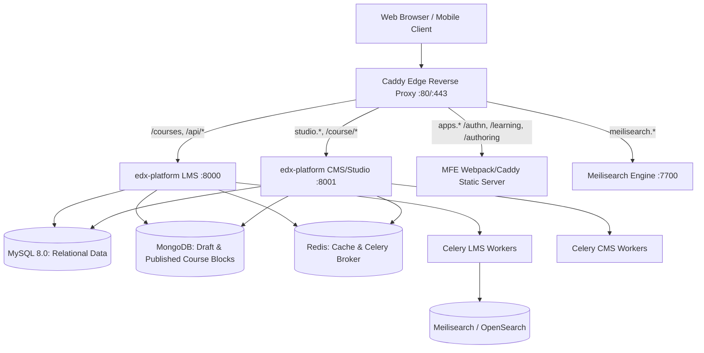
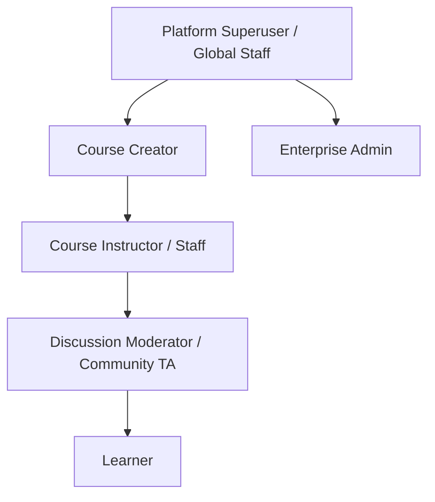
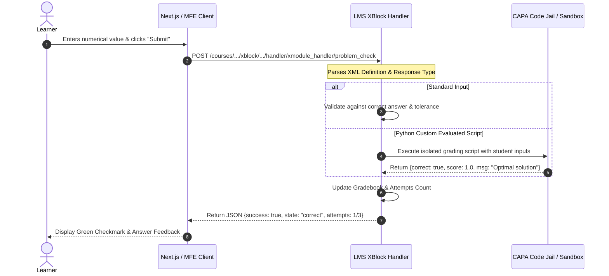
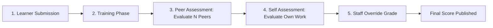
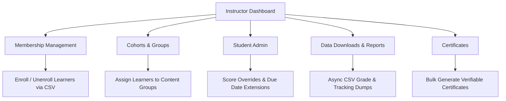

# Open edX Architecture, Functional Specification & Frontend Analysis

> [!IMPORTANT]
> **Explicit Scope Statement:**
> **Next.js click-through implementation intentionally deferred to the next phase. The implementation will be based on this approved documentation and proposed frontend architecture produced in this phase.**

---

## Executive Summary & System Overview

**Open edX** is the world-standard, open-source Massive Open Online Course (MOOC) and course-centric learning platform, originally developed by MIT and Harvard and governed by the **Axim Collaborative**. Unlike institutional, term-constrained LMS platforms (such as Canvas LMS, Blackboard, or Moodle) that center on campus rosters and term cohorts, Open edX is engineered for **asynchronous, high-scale, course-centric pedagogical delivery**, supporting millions of learners per instance with fine-grained automated grading, micro-sequenced units, and modular XBlock extensions.

This document delivers a definitive technical specification, learning hierarchy model, assessment engine analysis, and frontend blueprint. It forms the architectural baseline for developing a **modern, unified Next.js + TypeScript frontend** that eliminates the operational friction and latency of Open edX's fragmented micro-frontend (MFE) ecosystem.

---

## 1. Open edX System & Architecture Profile

### 1.1 Core Platform Architecture

The platform topography is composed of core Django/Python applications, data stores, worker queues, and an edge reverse proxy orchestrator:



#### Core Components & Deployment Topology
- **`edx-platform` LMS (Learning Management System):**
  - High-performance Django application serving learner endpoints, authentication sessions, enrollment logic, grades calculations, and REST API interfaces.
  - Serves static assets, XBlock student runtime views, and OAuth2 provider tokens.
- **`edx-platform` CMS (Studio / Course Authoring):**
  - Course authoring backend where educators build learning taxonomies, author CAPA problems, configure grading policies, and publish release versions.
- **Tutor Orchestration Runtime:**
  - Modern, containerized deployment engine for Open edX. Tutor generates standardized Docker Compose environments (`tutor_local`, `tutor_dev`), provisions environment files, manages automated database migrations, and binds services via Docker networking.
- **Relational Store (MySQL 8.0 / MariaDB):**
  - Stores relational system entities: user authentication credentials, profiles, course enrollments, grade records, certificate hashes, discussion subscriptions, and site configurations.
- **Document Store (MongoDB):**
  - Stores the native Open edX **Course Structure (Split Mongo / Old Mongo)**. Course modules, chapters, sequentials, verticals, and XBlock definitions are stored as JSON-like documents with revision trees allowing draft versus published states.
- **Search & Indexing Engine (Meilisearch / OpenSearch):**
  - Powers full-text course catalog discovery, faceted search queries (organization, language, pacing), and in-course discussion forum thread searches.
- **Asynchronous Task Queue (Celery + Redis):**
  - Handles long-running platform tasks: asynchronous gradebook export generation, bulk email delivery, certificate rendering, and course tarball imports/exports.

---

### 1.2 Micro-Frontend (MFE) Ecosystem

Historically built as server-rendered Django templates (Mako), Open edX has migrated its user interface into decoupled, single-page React applications known as **MFEs**. While this modernized component boundaries, it introduced significant runtime fragmentation:

| Micro-Frontend (MFE) | Package Name | Routing Host / Path | Primary Purpose & Functional Boundaries |
|---|---|---|---|
| **Courseware & Learning** | `frontend-app-learning` | `apps.local.openedx.io/learning` | Renders the primary courseware view: Horizontal Unit Sequencer, Cinema Video Player, XBlock sandboxes, sidebar drawer, and progress breadcrumbs. |
| **Course Authoring / Studio** | `frontend-app-course-authoring` | `apps.local.openedx.io/authoring` | Modern Studio authoring workspace for curriculum outlines, section/unit creation, and live component updates. |
| **Gradebook** | `frontend-app-gradebook` | `apps.local.openedx.io/gradebook` | High-performance instructor grading matrix allowing course teams to inspect, override, and excuse student assignment scores. |
| **Discussions** | `frontend-app-discussions` | `apps.local.openedx.io/discussion` | Unified forum interface supporting contextual unit-level questions, general threads, upvoting, instructor endorsement, and thread filtering. |
| **Account & Profile** | `frontend-app-account` & `profile` | `apps.local.openedx.io/account` | Self-service learner settings: account security, password resets, social auth linking, language, biographical details, and timezone. |
| **Communications** | `frontend-app-communications` | `apps.local.openedx.io/communications` | Course updates, instructor announcements, automated milestone emails, and cohort messages. |
| **Authentication** | `frontend-app-authn` | `apps.local.openedx.io/authn` | Centralized identity portal: multi-step login, user registration, SSO redirects, and password recovery. |

---

### 1.3 REST & GraphQL API Endpoints

The modern Open edX architecture exposes versioned REST APIs consumed by the MFEs and external clients:

| Functional Area | Endpoint Path | Method | Purpose & Payload Overview |
|---|---|---|---|
| **Course Catalog** | `/api/courses/v1/courses/` | `GET` | Returns paginated list of published courses with banner images, pacing, start/end timestamps, and block URLs. |
| **Course Blocks** | `/api/courses/v1/blocks/{usage_key}` | `GET` | Fetches the complete or subsection-level XBlock tree for an authenticated user. Accepts `depth=all`, `student_view_data`, and `requested_fields`. |
| **Course Outline** | `/api/course_home/v1/outline/{course_id}` | `GET` | Delivers the structured chapter/section syllabus, release dates, completion markers, and resume target. |
| **Learner Home / Dashboard** | `/api/learner_home/init/` | `GET` | Provides authenticated learner dashboard payload: enrolled courses, grade status, upgrade banners, and recommendations. |
| **Enrollments** | `/api/enrollment/v1/enrollment/` | `GET`, `POST` | Fetches or creates user enrollments. Payload: `{"course_details": {"course_id": "..." }, "mode": "audit"\|"verified"}`. |
| **User Identity** | `/api/user/v1/me` | `GET` | Returns requesting user's profile, username, email, permissions, and administrative roles. |
| **Account Management** | `/api/user/v1/accounts/{username}/` | `GET`, `PATCH` | Reads or updates user profile metadata (country, level of education, bio). |
| **Grades & Progress** | `/api/course_home/v1/progress/{course_id}` | `GET` | Returns learner's cumulative score, assignment breakdown against grading policy cutoffs, and certificate qualification status. |
| **Course Dates** | `/api/course_home/v1/dates/{course_id}` | `GET` | Returns ordered chronological timeline of course deadlines, released units, and verification deadlines. |
| **Discussion Threads** | `/api/discussion/v1/threads/` | `GET`, `POST` | Queries course discussions with filters (`course_id`, `topic_id`, `sort_key`). Creates new discussion or question threads. |
| **XBlock Student View** | `/courses/{course_id}/xblock/{usage_id}/handler/{handler_name}` | `POST` | Submits problem answers (e.g. `xmodule_handler/problem_check`), fetches hints, or resets problem state. |

---

## 2. Learning Hierarchy (The 5-Level Structure)

Open edX organizes educational curricula through a strictly validated **5-Level Pedagogical Taxonomy**. This structure differs fundamentally from institutional course management systems:

```
[Level 1] Course Container (course-v1:Org+Course+Run)
   │
   ├── [Level 2] Section / Chapter ("Week 1: Foundations of Microservices")
   │      │
   │      └── [Level 3] Subsection / Sequential ("1.1 Architectural Tradeoffs")
   │             │
   │             └── [Level 4] Unit / Vertical ("Core Theory & Video Lecture")
   │                    │
   │                    ├── [Level 5] Component: Video XBlock (HLS Stream + Transcript)
   │                    ├── [Level 5] Component: HTML Content (Rich Text & Graphics)
   │                    ├── [Level 5] Component: CAPA Problem (Formulas & Checkboxes)
   │                    └── [Level 5] Component: Discussion XBlock (Inline Q&A)
```

### Detailed Level Specifications:

1. **Level 1: Course (`course-v1:Org+Course+Run`):**
   - The root namespace and top-level governance boundary.
   - Identified by an opaque, immutable string: `course-v1:{Org}+{Course_Number}+{Run_Identifier}` (e.g., `course-v1:OpenedX+DemoX+DemoCourse`).
   - Governs pace configuration: **Self-Paced** (learners unlock all material immediately with personalized flexible schedules) versus **Instructor-Paced** (sections unlock sequentially based on global UTC calendar dates).
   - Manages global certificate passing criteria (e.g., cut score $\ge 70\%$).

2. **Level 2: Section / Chapter:**
   - The primary thematic or chronological division (e.g., "Module 1: Distributed Storage", "Week 3: Consensus Protocols").
   - Can have visibility release dates and cohort access rules.

3. **Level 3: Subsection / Sequential:**
   - The graded or diagnostic milestone container.
   - Holds grading assignments: assigned a specific **Format / Assignment Type** (e.g., "Homework", "Lab", "Midterm Exam", "Final Project").
   - Governs soft and hard submission deadlines. Subsections render as the top tab milestones in traditional players.

4. **Level 4: Unit / Vertical:**
   - Represents the **single-page learner viewport**.
   - Corresponds to one active tab or dot in the horizontal unit sequencer.
   - Aggregates multiple learning components rendered vertically down the page. Learner completion is tracked at this level when all child components are engaged.

5. **Level 5: Component / XBlock:**
   - The atomic learning primitive.
   - Modular, isolated applications conforming to the Open edX **XBlock API standard**.
   - Examples: HTML reading blocks, Video players with synchronized transcript engines, CAPA problem interactives, ORA peer rubrics, LTI container frames, and Google Drive embeds.

---

## 3. User Roles & Enrolment Tracks

### 3.1 Platform & Course Roles

Open edX employs a layered Role-Based Access Control (RBAC) model operating across platform-wide, tenant-wide, and course-scoped dimensions:



- **Platform Superuser / Global Staff:**
  - Has unrestricted global access across LMS and CMS.
  - Can configure Django settings, manage multi-tenancy, inspect audit logs, and trigger administrative database routines.
- **Course Creator / Author:**
  - Authorized to initialize new courses in Studio (`studio.local.openedx.io`), define course keys, and assign course team permissions.
- **Instructor / Course Staff:**
  - Full operational control over an individual course run: edits curriculum in Studio, configures grading schemes, issues grade overrides, generates asynchronous grade reports, and manages student enrollments.
- **Discussion Moderator / Community TA:**
  - Course-scoped forum authority: can pin announcements, endorse authoritative student answers, edit or delete inappropriate comments, and open/close thread discussions.
- **Enterprise Customer Admin:**
  - B2B portal user: monitors cohort progress, tracks employee enrollment quotas, and exports organizational compliance telemetry.
- **Learner:**
  - Primary consumer: enrolls in courses, progresses through verticals, submits assessment answers, interacts in forums, and claims digital certificates.

---

### 3.2 Enrolment Tracks & Modes

Course access, certificate eligibility, and pricing are dictated by enrollment **modes**:

| Mode / Track | Price Point | Content Access Boundary | Graded Assignments | ID Verification | Certificate Issued |
|---|---|---|---|---|---|
| **Audit Track** | Free | Full or timed access to course content. May have expiration dates tied to course end. | May view problems; access to graded tests may be restricted. | No | None |
| **Verified Track** | Paid | Permanent access to course archive and full problem set. | Full access to all graded homeworks and exams. | Yes (Webcam + Govt ID verification) | Cryptographically verifiable digital PDF/web certificate |
| **Honor Track** | Free / Low Cost | Full access to course materials. | Full access under platform honor pledge. | No | Basic completion certificate |
| **Professional Education** | Enterprise / Premium | Modular high-touch executive content with dedicated cohorts. | Full access + project deliverables. | Optional / Enterprise SSO | Executive Certificate of Specialization |

---

## 4. Assessment Engines & XBlock Ecosystem

Open edX's primary technical differentiator is its rigorous, mathematically sound assessment engine, capable of running complex automated evaluations at MOOC scale.

### 4.1 CAPA (Computer-Assisted Personalized Approach) Problem Engine

The CAPA engine executes within the `problem` XBlock, evaluating student inputs either client-side or securely in a sandboxed Python runtime:



#### Supported CAPA Problem Types:
1. **Multiple Choice (`<multiplechoiceresponse>`):**
   - Single-choice radio buttons with randomized distractor ordering per student attempt.
2. **Checkboxes (`<choiceresponse>`):**
   - Multi-select problems supporting partial credit algorithms (`every-half`, `partial-credit-count`).
3. **Dropdown Selection (`<optionresponse>`):**
   - Inline sentence completion dropdowns.
4. **Numerical Input (`<numericalresponse>`):**
   - Accepts floating-point values and checks against absolute ($\pm \delta$) or relative ($\pm 5\%$) error tolerances.
5. **Formula Input (`<formularesponse>`):**
   - Evaluates symbolic mathematical expressions (e.g. `sin(x)^2 + cos(x)^2 == 1`). Employs random sampling of variables across a domain to verify symbolic equivalence without hardcoded string matching.
6. **Text Input with Regex (`<stringresponse>`):**
   - Validates student input strings using regular expression matching with optional whitespace and case insensitivity.
7. **Custom Python-Evaluated Scripts (`<customresponse>`):**
   - Executes arbitrary sandboxed Python code via **CodeJail** (Linux AppArmor/seccomp). The script receives learner parameters, evaluates multi-variable conditions, and assigns partial scores dynamically.
8. **Operational Controls:**
   - `max_attempts`: Enforces maximum attempts (e.g., 3 tries).
   - `rerandomize`: Re-generates problem variable seeds upon reset.
   - `showanswer`: Conditions for showing answers (`never`, `past_due`, `attempted`, `after_all_attempts`).

---

### 4.2 Open Response Assessment (ORA / OpenAssessment)

For open-ended essays, design portfolios, and complex code submissions that cannot be automatically evaluated, Open edX provides the **OpenAssessment XBlock (`openassessment`)**.



#### Step-by-Step Workflow:
1. **Rubric Authoring:** Instructors author multi-criterion rubrics with discrete score categories and descriptive performance criteria.
2. **Learner Submission:** Learner submits rich text and optional file attachments (images, PDFs, ZIP archives).
3. **Student Training (Calibration):** (Optional) Learners evaluate pre-graded benchmark examples to calibrate their scoring accuracy against instructor baselines before entering the peer pool.
4. **Peer Assessment:** Learners must assess a configurable number of peers (e.g., $N=3$ submissions) using the rubric. Scores are determined using median or weighted average algorithms.
5. **Self Assessment:** Learners grade their own submission against the rubric.
6. **Staff Override & Mediation:** Course instructors have override authority to resolve peer score disputes or handle anomalous grading.

---

### 4.3 Video XBlock

The Open edX Video Player (`video` XBlock) delivers optimized streaming video:
- **Engine:** Built upon VideoJS with custom Open edX plugins.
- **Streaming Protocols:** Supports adaptive bitrate HLS (`.m3u8`), YouTube video embeds, and direct MP4 fallbacks.
- **Synchronized Transcript Engine:** Parses WebVTT and SubRip (`.srt`) transcripts. Highlights spoken phrases in real-time with an auto-scrolling transcript window and allows learners to click any transcript segment to jump to that timestamp.
- **Playback Controls:** Variable playback speed (0.5x, 0.75x, 1.0x, 1.25x, 1.5x, 2.0x), closed-caption language selectors, and volume persistence.
- **Completion Tracking:** Emits `play`, `pause`, and `seek` events to the tracking log (`edx.video.played`). Marks the unit video component as completed once a threshold percentage (typically 95%) is reached.

---

### 4.4 External Tools (LTI 1.3 Advantage)

Open edX natively supports the **IMS Global LTI 1.3 Advantage** specification:
- Enables launching external interactive tools (JupyterHub notebooks, Vocareum coding labs, MATLAB interactives, third-party proctoring) directly inside unit viewports.
- Supports **Assignment and Grade Services (AGS)**: automatically relays scores from external tool execution back to the Open edX gradebook over secure OAuth2 channels.
- Supports **Names and Role Provisioning Services (NRPS)**: passes learner cohort and permission context securely to the tool provider.

---

## 5. Instructor & Administrative Governance

### 5.1 Studio (CMS) Workflow

Studio (`cms.openedx`) serves as the course authoring workbench:

- **Outline Editor:**
  - Hierarchical drag-and-drop course builder.
  - Allows organizing Sections, Subsections, and Units with visual status indicators (**Published**, **Draft (Never Published)**, **Unpublished Changes**).
- **Grading Policy Configuration:**
  - Instructors define custom assignment types (e.g. "Homework", "Quizzes", "Final Exam").
  - Configures assignment weighting percentages (e.g., Homework = 40%, Midterm = 25%, Final = 35%).
  - Configures "Drop Lowest $N$" rules (e.g., drop the single lowest homework score automatically).
  - Configures passing cutoffs on a visual score scale.
- **Visibility Gates & Prerequisite Gating:**
  - Content release schedules (relative or absolute UTC release dates).
  - Cohort-specific unit visibility (releasing targeted content only to specific student tracks or enterprise groups).
  - Prerequisite course requirements: blocks access to advanced sections until baseline prerequisites are completed.
- **Import & Export:**
  - Course packages export as standardized `.tar.gz` tarballs.
  - Contains raw XML definitions (`course.xml`), policies, assets, problem templates, and sequential trees, enabling version control with Git.

---

### 5.2 Instructor Dashboard

The LMS Course Instructor Dashboard provides operational management:



- **Membership Management:**
  - Single and batch CSV enrollments and un-enrollments.
  - Role delegation: assigning Staff, Instructor, Beta Tester, and Discussion Moderator privileges to user accounts.
- **Cohorts & Content Groups:**
  - Divides course learners into isolated groups for targeted discussions and segmented content access.
- **Student Administration & Grade Overrides:**
  - Problem attempt rescoring: triggers recalculation when a problem XML bug is fixed.
  - Attempt reset: clears student attempts for individual problems.
  - Due date extensions: grants individual students accommodations.
- **Asynchronous Data Downloads:**
  - Requests asynchronous background generation of student grade reports, anonymized problem response dumps, and course census data via Celery workers.
- **Certificate Generation:**
  - Triggers bulk certificate generation upon course completion. Issues cryptographic certificate verification hashes.

---

## 6. Screen-by-Screen Breakdown & UI Evidence

The following section provides a detailed breakdown of all primary user interfaces verified against our local Open edX instance. All screenshots have been captured directly from the running local environment (`http://local.openedx.io`, `http://apps.local.openedx.io`, and `http://studio.local.openedx.io`).

---

### Screen 1: Public Discovery Catalog

- **Screen Name:** Public Discovery Catalog & Course Search
- **MFE / App Name:** `frontend-app-catalog` / LMS Course Discovery
- **Primary User Role:** Unauthenticated Anonymous Visitor / Prospective Learner
- **URL / Route:** `http://apps.local.openedx.io/catalog/` (Redirected from `http://local.openedx.io/courses`)
- **Entry Point:** Platform homepage navigation, direct course catalog link, or search query.

#### Visual Evidence:


#### Detailed UI Components:
- **Hero Search Bar:** Full-text search input with instantaneous autocomplete against Meilisearch.
- **Faceted Filter Drawer / Sidebar:** Multi-select facets:
  - *Subject* (Computer Science, Data Science, Humanities).
  - *Organization / Partner* (OpenedX, edX, University Partners).
  - *Availability* (Available Now, Upcoming, Archived).
  - *Pacing* (Self-Paced vs. Instructor-Paced).
  - *Language* (English, Spanish, etc.).
- **Course Grid:** Responsive multi-column layout displaying course teaser cards.
- **Course Card Primitive:**
  - Course Hero Banner Image (`DemoX-Course-Card.png`).
  - Partner Organization Tag (`OpenedX`).
  - Course Title (`Open edX Demo Course`).
  - Course Code / Number Badge (`DemoX`).
  - Pacing Indicator Pill ("Self-Paced").
  - Start Date Indicator ("Started Jan. 1, 2020").

#### Primary & Secondary Actions:
- **Primary Action:** Click Course Card to navigate to Course About / Marketing page.
- **Secondary Action:** Filter catalog results via sidebar facets; clear all filters.

#### UI States:
- **Loading State:** Skeleton card placeholders with shimmering rectangular boxes for cards and search filters.
- **Empty State:** "No courses match your filter criteria" message with a "Clear all filters" CTA button.
- **Populated State:** Displays verified active course cards (`OpenedX Demo Course`).
- **Error State:** Alert notification: "Unable to load courses. Please retry or refresh."

#### Interactive User Flows:
1. Visitor navigates to `/courses`.
2. Types keywords into the search box.
3. Selects "Self-Paced" filter facet.
4. Clicks the resulting "Open edX Demo Course" card to open the Course About page.

---

### Screen 2: Authentication Gateway (Login & Register)

- **Screen Name:** Authentication Gateway (Sign In & Registration)
- **MFE / App Name:** `frontend-app-authn`
- **Primary User Role:** Unauthenticated Learner / Staff
- **URL / Route:** `http://apps.local.openedx.io/authn/login` (or `/login`)
- **Entry Point:** "Sign In" / "Register" header button from catalog or courseware redirect.

#### Visual Evidence:


#### Detailed UI Components:
- **Branded Auth Card:** Centered card with Open edX / custom organization logo.
- **Input Fields:** Floating label text inputs for `emailOrUsername` and `password`.
- **Password Visibility Toggle:** Eye icon revealing entered characters.
- **"Forgot Password?" Link:** Initiates asynchronous password reset email workflow.
- **Primary Submit Button:** "Sign in" full-width button with hover states.
- **Social / SAML SSO Divider:** "Or sign in with" options (Google, Microsoft, GitHub, Enterprise SAML).
- **Registration Toggle:** "Don't have an account? Create an account" switching to the registration form.

#### Primary & Secondary Actions:
- **Primary Action:** Authenticate credentials ("Sign in").
- **Secondary Action:** Navigate to Registration form; initiate Password Reset.

#### UI States:
- **Loading State:** Disabled submit button displaying animated spinner with text "Signing in...".
- **Empty State:** Clean, pristine input inputs with focus highlights.
- **Error State:** Red border on invalid fields with inline text: "The username or password you entered is incorrect."
- **Success State:** Instant redirect to learner dashboard (`/learner-dashboard/`) or destination `next` parameter.

#### Interactive User Flows:
1. Learner visits login screen.
2. Enters email `learner@example.com` and password `Learn@12345`.
3. Submits form; client validates CSRF token against LMS cookie.
4. On 200 OK, authenticated session cookie is stored and browser redirects to `/learner-dashboard/`.

---

### Screen 3: Course About / Marketing Page

- **Screen Name:** Course About / Marketing & Syllabus Page
- **MFE / App Name:** LMS Native Course Home / `frontend-app-catalog`
- **Primary User Role:** Prospective Learner / Enrolled Learner
- **URL / Route:** `http://local.openedx.io/courses/course-v1:OpenedX+DemoX+DemoCourse/about`
- **Entry Point:** Click on course card from catalog or shared marketing link.

#### Visual Evidence:


#### Detailed UI Components:
- **Header Banner:** Course title, organization logo, short description, and hero video modal trigger.
- **Course Summary Callout Card:**
  - Course Number (`DemoX`).
  - Classes Start date / Estimated Pace.
  - Estimated Effort (e.g., "2–3 hours per week").
  - Cost / Certificate Fee (Free Audit vs. Verified Track).
  - Enrollment Action Button ("Enroll Now" or "View Course").
- **Curriculum Details Tabs:**
  - "About this course" narrative overview.
  - What you will learn bulleted learning objectives.
  - Syllabus outline detailing weekly topics and assessments.
  - Course Staff & Instructor Bios with headshots and credentials.
  - Prerequisites list.

#### Primary & Secondary Actions:
- **Primary Action:** "Enroll Now" (if un-enrolled) or "View Course" (if already enrolled).
- **Secondary Action:** Watch course intro video; read instructor biographies.

#### UI States:
- **Loading State:** Skeleton layout representing summary callout and body text blocks.
- **Un-enrolled Populated State:** "Enroll Now" CTA prominent in hero and summary card.
- **Enrolled Populated State:** Button updates to "You are enrolled in this course — View Course".
- **Error State:** "Course not found" or "Enrollment is closed for this course run."

#### Interactive User Flows:
1. Prospective learner lands on the About page.
2. Clicks "Enroll Now".
3. System checks session: if logged in, invokes `/api/enrollment/v1/enrollment/` and routes to Track Selection (Audit vs. Verified) or directly to the Course Home.

---

### Screen 4: Student Dashboard (Learner Home)

- **Screen Name:** Student Dashboard (Learner Home)
- **MFE / App Name:** `frontend-app-learner-dashboard` (or `frontend-app-learning`)
- **Primary User Role:** Authenticated Learner
- **URL / Route:** `http://apps.local.openedx.io/learner-dashboard/` (or `http://local.openedx.io/dashboard`)
- **Entry Point:** Post-login destination or clicking "Dashboard" in the global navigation bar.

#### Visual Evidence:


#### Detailed UI Components:
- **User Welcome Banner:** Personal greeting with learner's display name.
- **Active Enrolled Courses List:** Vertically stacked or grid-based cards for each enrolled course run.
- **Enrolled Course Card:**
  - Thumbnail course asset image.
  - Course Organization & Title.
  - Pacing & Current Progress Status Indicator.
  - Track Badge (e.g., "Audit Access", "Verified Certificate").
  - Primary CTA: "Resume Course" or "Start Course" jumping directly to last accessed unit.
  - Options Dropdown: "Email Settings", "Unenroll", "Course Details".
  - Upgrade Banner: "Upgrade to Verified Track" prompt with countdown to upgrade deadline.
- **Sidebar Widgets:** Recommended courses, platform announcements, and support documentation links.

#### Primary & Secondary Actions:
- **Primary Action:** Click "Resume Course" to launch directly into the learning sequencer.
- **Secondary Action:** Unenroll from course; upgrade to verified certificate track.

#### UI States:
- **Loading State:** Shimmering cards representing active course enrollments.
- **Empty State:** "You are not enrolled in any courses yet." with a large "Explore Courses" button routing to `/courses`.
- **Populated State:** Displays active enrollments (`Open edX Demo Course`).
- **Error State:** Banner: "There was an error loading your courses. Please try again."

#### Interactive User Flows:
1. Learner arrives at Dashboard after login.
2. Locates `Open edX Demo Course`.
3. Clicks "Resume Course".
4. Application redirects directly to the last-saved unit in the Courseware Player.

---

### Screen 5: Course Home & Outline

- **Screen Name:** Course Home & Curriculum Outline
- **MFE / App Name:** `frontend-app-learning`
- **Primary User Role:** Enrolled Learner / Course Staff
- **URL / Route:** `http://apps.local.openedx.io/learning/course/course-v1:OpenedX+DemoX+DemoCourse/home`
- **Entry Point:** Clicking course title from dashboard or navigation tab.

#### Visual Evidence:


#### Detailed UI Components:
- **Course Navigation Bar:** Top tabs: **Course**, **Progress**, **Dates**, **Discussion**, (and **Instructor** if staff).
- **Resume Banner:** Top actionable banner: "Resume your course where you left off" with direct link to current vertical.
- **Accordion Curriculum Outline:**
  - Expandable Section / Chapter accordions.
  - Nested Subsection / Sequential items with assignment icons (Pencil for problems, Play icon for videos).
  - Due date and grading category annotations (e.g. "Homework - Due Oct 15").
  - Completion checkmark icons indicating completed units.
- **Right Sidebar Tools:**
  - Course Important Dates widget.
  - Course Handouts and Syllabus download links.
  - Weekly goal tracker widget.

#### Primary & Secondary Actions:
- **Primary Action:** Click any subsection or unit link to enter the Courseware Player.
- **Secondary Action:** Expand/collapse curriculum sections; download course handouts.

#### UI States:
- **Loading State:** Accordion outline skeletons.
- **Populated State:** Full chapter structure with release timestamps and completion ticks.
- **Locked State:** Sections locked behind prerequisite requirements or future calendar release dates display lock icons.

#### Interactive User Flows:
1. Learner opens Course Home.
2. Reviews syllabus hierarchy.
3. Expands "Example: Video & Homework".
4. Clicks on the subsection to transition into the Learning Player.

---

### Screen 6: Learning Player (Courseware & Unit Sequencer)

- **Screen Name:** Learning Player (Unit Sequencer & XBlock Viewport)
- **MFE / App Name:** `frontend-app-learning`
- **Primary User Role:** Enrolled Learner
- **URL / Route:** `http://local.openedx.io/courses/course-v1:OpenedX+DemoX+DemoCourse/courseware`
- **Entry Point:** Clicking any unit from course outline or "Resume Course".

#### Visual Evidence:


#### Detailed UI Components:
- **Top Unit Sequencer Bar:**
  - Horizontal carousel/stepper representing all units (verticals) in the current sequential.
  - Unit type icons (Video, Problem, Discussion, Reading).
  - Active unit highlight pill.
  - Checkmarks for completed units.
- **Unit Title & Bookmark Button:** Displays vertical name with a toggle bookmark icon for quick access.
- **Component Viewport (Vertical):** Renders child XBlocks vertically:
  - Cinema Video Player with auto-scrolling WebVTT transcript drawer.
  - Rich text reading materials.
  - CAPA problem interactive containers with "Submit" and "Show Answer" buttons.
- **Bottom Navigation Bar:**
  - "Previous Unit" and "Next Unit" navigation buttons.
  - Unit completion status indicators.
- **Sidebar Drawer (Collapsible):** In-course outline drawer allowing unit jumps without leaving the player.

#### Primary & Secondary Actions:
- **Primary Action:** Interact with XBlocks (watch video, submit problem responses); click "Next" to advance.
- **Secondary Action:** Bookmark unit; open synchronous transcript; jump via sequencer tabs.

#### UI States:
- **Loading State:** Centered spinner with sequential stepper skeletons.
- **Populated Active State:** Full interactive viewport with working XBlock handlers.
- **Submitted Assessment State:** Problem component renders instant green/red status with points awarded (e.g. "1/1 point").
- **Error State:** Fallback error card inside XBlock: "Error loading component. Please reload."

#### Interactive User Flows:
1. Learner enters Unit 1.
2. Watches the lecture video; completion telemetry registers in background.
3. Advances to Unit 2 (CAPA Homework Problem).
4. Selects checkbox option and clicks "Submit".
5. Receives instant score evaluation and feedback.
6. Clicks "Next" to progress to the subsequent vertical.

---

### Screen 7: Progress & Grades Tab

- **Screen Name:** Progress & Grades Analytics
- **MFE / App Name:** `frontend-app-learning`
- **Primary User Role:** Enrolled Learner
- **URL / Route:** `http://apps.local.openedx.io/learning/course/course-v1:OpenedX+DemoX+DemoCourse/progress`
- **Entry Point:** "Progress" tab in the course navigation bar.

#### Visual Evidence:


#### Detailed UI Components:
- **Grade Distribution Chart:**
  - Visual stacked bar chart illustrating total cumulative score against certificate passing cutoffs.
  - Categorical bars for each assignment group: Homework, Labs, Midterm, Final Exam.
  - Target passing cutoff threshold line (e.g. at 70%).
- **Grade Breakdown List:**
  - Detailed breakdown of each individual graded sequential.
  - Displayed format: `Score: 90% (9/10 points) - Homework 1`.
  - Dropped lowest score annotations (e.g. "Lowest score dropped").
- **Certificate Status Box:**
  - Passing status banner: "You are currently passing this course."
  - Certificate issuance status: "Certificate will be issued after course conclusion."

#### Primary & Secondary Actions:
- **Primary Action:** Review grades across all categories; identify assignments requiring improvement.
- **Secondary Action:** View certificate if course is completed and passing.

#### UI States:
- **Loading State:** Chart container with shimmering placeholder rectangles.
- **Populated State:** Displays interactive SVG/Canvas grade chart and graded items list.
- **Audit Mode Notice:** Callout banner: "You are enrolled in the Audit track. Upgrade to Verified to earn a graded certificate."

#### Interactive User Flows:
1. Learner submits multiple assignments throughout the course.
2. Navigates to the "Progress" tab.
3. Inspects current cumulative grade score against the passing threshold.
4. Identifies which assignment category has the highest weight remaining.

---

### Screen 8: Dates Tab (Course Schedule Timeline)

- **Screen Name:** Course Dates & Milestone Timeline
- **MFE / App Name:** `frontend-app-learning`
- **Primary User Role:** Enrolled Learner
- **URL / Route:** `http://apps.local.openedx.io/learning/course/course-v1:OpenedX+DemoX+DemoCourse/dates`
- **Entry Point:** "Dates" tab in the course navigation bar.

#### Visual Evidence:


#### Detailed UI Components:
- **Timeline Header:** Summary banner showing course start date, current pace, and estimated end date.
- **Chronological Milestone Stream:**
  - Vertical timeline dividing assignments into "Completed", "Past Due", "Due This Week", and "Upcoming".
  - Date and time badges rendered in the learner's localized timezone.
  - Milestone links directing straight to the corresponding subsection in the courseware.
- **Calendar Sync Button:** "Add to Calendar" button (iCalendar / Google Calendar `.ics` subscription).

#### Primary & Secondary Actions:
- **Primary Action:** Click milestone link to jump into the upcoming assignment.
- **Secondary Action:** Subscribe to external calendar sync feed.

#### UI States:
- **Loading State:** Vertical line skeleton with circular milestone placeholders.
- **Populated State:** Fully annotated timeline with date markers.
- **Empty State:** "No specific due dates for this self-paced course."

#### Interactive User Flows:
1. Learner clicks "Dates" tab.
2. Checks deadline for "Homework 2".
3. Clicks the assignment name in the timeline.
4. Directly arrives at the unit inside the Learning Player.

---

### Screen 9: Discussions Tab (Course Forums)

- **Screen Name:** Course Discussions & Community Forums
- **MFE / App Name:** `frontend-app-discussions`
- **Primary User Role:** Learner / Discussion Moderator / Course Staff
- **URL / Route:** `http://apps.local.openedx.io/learning/course/course-v1:OpenedX+DemoX+DemoCourse/discussion`
- **Entry Point:** "Discussion" tab in course navigation or in-context discussion XBlock.

#### Visual Evidence:


#### Detailed UI Components:
- **Forum Search & Filter Bar:** Keyword search, sort dropdown (Recent activity, Most upvotes), and post type filters (All Posts, Questions, Discussions).
- **Topic Category Sidebar / Dropdown:** General topics, course news, and unit-specific topics.
- **Thread List:** Left column displaying thread summaries, author badges, unread indicators, and reply counts.
- **Active Thread Pane:**
  - Thread Question / Discussion post with author role badge (Staff, TA, Community).
  - Endorsed Answer Box: Highlighted green box showing instructor-endorsed response.
  - Nested comments and responses with upvoting buttons.
  - "Follow" button to subscribe to email notifications.
- **Add Post Drawer / Modal:** Form to compose questions or general discussions with Markdown formatting.

#### Primary & Secondary Actions:
- **Primary Action:** Post a question; submit a reply to a thread; upvote helpful responses.
- **Secondary Action:** Filter threads by topic; follow thread.

#### UI States:
- **Loading State:** Split pane skeleton with list placeholders.
- **Empty State:** "No discussions found for this topic. Be the first to start a conversation!"
- **Populated State:** Active thread stream with reply counters.

#### Interactive User Flows:
1. Learner encounters an issue in an assignment.
2. Navigates to "Discussion" tab.
3. Searches for problem keywords.
4. Reads endorsed answer or posts a new question thread.

---

### Screen 10: Studio Outline Editor (Course Authoring CMS)

- **Screen Name:** Studio Course Outline Editor
- **MFE / App Name:** `frontend-app-course-authoring` / Studio CMS
- **Primary User Role:** Course Author / Staff / Instructor
- **URL / Route:** `http://apps.local.openedx.io/authoring/course/course-v1:OpenedX+DemoX+DemoCourse` (or `http://studio.local.openedx.io/course/...`)
- **Entry Point:** Studio course card click or "Studio" link for authorized staff.

#### Visual Evidence:


#### Detailed UI Components:
- **Studio Header & Top Nav:** Course title, settings dropdown (Schedule & Details, Grading, Course Team, Group Configurations), and "View Live" button.
- **Action Toolbar:** "New Section" button, Expand/Collapse All toggle, and Search/filter outline input.
- **Visual Curriculum Tree:**
  - Section blocks with release date indicators and drag handles.
  - Subsection blocks with grading format tags (e.g. "Graded: Homework").
  - Unit rows with publication status pills (**Published and Live**, **Draft**, **Unpublished Changes**).
- **Inline Action Buttons:** "Configure" gear icon, "Duplicate" icon, and "Delete" trash can icon on each node.
- **"New Subsection" & "New Unit" Drop Zones:** Dashed clickable buttons at the bottom of each hierarchy level.

#### Primary & Secondary Actions:
- **Primary Action:** Add or edit sections, subsections, and units; publish draft changes to live LMS.
- **Secondary Action:** Rearrange hierarchy via drag-and-drop; access course grading policy.

#### UI States:
- **Loading State:** Centered loader while fetching course tree from Split Mongo.
- **Populated State:** Complete structural tree with color-coded status badges.
- **Unsaved Draft State:** Unit pill turns yellow: "Draft - changes not published".

#### Interactive User Flows:
1. Instructor opens Studio.
2. Clicks "+ New Section" -> enters "Module 2: Advanced Topics".
3. Adds a Subsection "2.1 Hands-on Lab".
4. Adds a Unit and clicks into it to author new HTML and CAPA problem components.
5. Clicks "Publish" to sync changes to the live student-facing LMS.

---

### Screen 11: Instructor Dashboard (Operations & Admin)

- **Screen Name:** LMS Instructor Operations Dashboard
- **MFE / App Name:** LMS Native Instructor App (`/instructor`)
- **Primary User Role:** Instructor / Course Staff / Superuser
- **URL / Route:** `http://local.openedx.io/courses/course-v1:OpenedX+DemoX+DemoCourse/instructor`
- **Entry Point:** "Instructor" tab in the courseware navigation (visible only to staff).

#### Visual Evidence:


#### Detailed UI Components:
- **Instructor Navigation Sub-tabs:**
  - **Course Info:** Enrollment numbers, enrollment track breakdown, course start/end date summary.
  - **Membership:** Student batch enrollment tool, un-enrollment tool, role assignment matrix.
  - **Cohorts:** Cohort group creator and automatic/manual student assignment tools.
  - **Student Admin:** Individual student grade inspection, problem attempt reset tools, due date extension utility.
  - **Data Download:** Asynchronous report generator (Grade Report CSV, Problem Responses CSV).
  - **Certificates:** Certificate whitelist management and bulk certificate issuance triggers.
- **Console Log / Task Status Box:** Live table showing asynchronous Celery background task progress.

#### Primary & Secondary Actions:
- **Primary Action:** Download CSV grade reports; reset problem attempts for a learner; enroll batch CSV learners.
- **Secondary Action:** Assign Discussion Moderator roles; adjust cohort group memberships.

#### UI States:
- **Loading State:** Sub-tab panel loader.
- **Populated State:** Displays operational forms and active background task log.
- **Task In-Progress State:** Displays progress bar: "Generating Grade Report CSV... (Celery Task #402)".

#### Interactive User Flows:
1. Instructor navigates to "Instructor" tab -> "Data Download".
2. Clicks "Generate Grade Report".
3. Celery background task executes.
4. When finished, a download link appears in the reports table; instructor downloads the completed CSV.

---

## 7. Next.js Frontend Modernization Blueprint

To overcome Open edX's fragmented user experience—caused by redirecting learners across multiple disparate React MFEs (`learning`, `authoring`, `authn`, `discussions`, `account`, each with independent bundles and session handshakes)—we propose a **Unified, State-of-the-Art Next.js (App Router) + TypeScript Architecture**.

### 7.1 Unified Route Hierarchy & Directory Structure

```
src/
├── app/
│   ├── (auth)/
│   │   ├── login/page.tsx               # Modern unified auth with social/SAML
│   │   └── register/page.tsx            # Multi-step onboarding
│   ├── (discovery)/
│   │   ├── courses/page.tsx             # Faceted catalog with instant Meilisearch filtering
│   │   └── courses/[courseId]/page.tsx  # Dynamic marketing & syllabus about page
│   ├── (learner)/
│   │   └── student/
│   │       ├── dashboard/page.tsx       # Unified learner home & active courses
│   │       ├── profile/page.tsx         # Account settings & credentials
│   │       └── courses/[courseId]/
│   │           ├── learn/page.tsx       # Cinema player, unit sequencer & XBlock sandbox
│   │           ├── progress/page.tsx    # Visual SVG grade distribution & cert status
│   │           ├── dates/page.tsx       # Chronological timeline & calendar sync
│   │           └── discussion/page.tsx  # Integrated contextual discussion board
│   └── (instructor)/
│       └── instructor/courses/[courseId]/
│           ├── builder/page.tsx         # Next.js drag-and-drop visual course builder
│           ├── grades/page.tsx          # Real-time SpeedGrader & gradebook matrix
│           └── cohorts/page.tsx         # Cohort & membership management
├── components/
│   ├── player/
│   │   ├── CinemaVideoPlayer.tsx        # VideoJS + Synced transcript engine
│   │   ├── UnitSequencer.tsx            # Horizontal stepper & progress pill
│   │   └── XBlockRenderer.tsx           # Sandboxed iframe / dynamic component resolver
│   ├── assessments/
│   │   ├── CapaProblem.tsx              # Numerical, Formula, Checkbox evaluators
│   │   └── OpenResponseRubric.tsx       # ORA peer & self evaluation steps
│   └── ui/                              # Unified Design System primitives
├── lib/
│   ├── api.ts                           # Typed Axios/Fetch client against Open edX REST APIs
│   ├── auth.ts                          # JWT/Session cookie parser & edge helpers
│   └── store/
│       ├── usePlayerStore.ts            # Zustand store: active unit, video timecode, sidebar
│       └── useCourseTreeStore.ts        # Zustand store: client-side course outline cache
└── middleware.ts                        # Edge route guard for role & enrollment gating
```

---

### 7.2 API Mapping Matrix: Open edX Backend to Next.js Frontend

The Next.js application replaces all separate React MFEs by consuming Open edX's standard backend APIs directly:

| Proposed Next.js Route | Open edX Native Backend API | Method | Caching & Fetching Strategy |
|---|---|---|---|
| `/courses` | `/api/courses/v1/courses/` + Meilisearch | `GET` | **ISR (Incremental Static Regeneration)** (revalidate: 300s) |
| `/courses/[courseId]` | `/api/courses/v1/courses/{courseId}` | `GET` | **ISR** (revalidate: 60s) with on-demand purge |
| `/student/dashboard` | `/api/learner_home/init/` | `GET` | **SSR (Server-Side Rendering)** + SWR client revalidation |
| `/student/courses/[courseId]/learn` | `/api/courses/v1/blocks/{usage_id}` | `GET` | Client-side React Query with infinite vertical caching |
| `/student/courses/[courseId]/progress` | `/api/course_home/v1/progress/{courseId}` | `GET` | **SSR** + React Query with optimistic grade updates |
| `/student/courses/[courseId]/dates` | `/api/course_home/v1/dates/{courseId}` | `GET` | Client-side React Query |
| `/student/courses/[courseId]/discussion`| `/api/discussion/v1/threads/` | `GET`, `POST`| Client-side SWR with real-time polling |
| `/instructor/courses/[courseId]/grades` | `/api/grades/v1/section_grades_breakdown` | `GET`, `POST`| React Query + Zustand mutation table |
| `/instructor/courses/[courseId]/builder`| `/api/course_home/v1/outline/{courseId}` | `GET`, `PATCH`| Client-side drag-and-drop state sync |

---

### 7.3 State Management & Performance Architecture

- **Server-Side Data Layer (React Query / SWR):**
  - Course outlines and block trees are cached aggressively on the client. Once a course structure is fetched via `/api/courses/v1/blocks/`, sub-unit navigation operates with zero latency ($< 10\text{ ms}$).
  - Background revalidation ensures completion checkmarks sync without interrupting video playback.
- **Client Player State (Zustand Store):**
  - Manages playback timecodes, sidebar drawer toggle state, and active sequencer indices.
  - Syncs learner video progress markers to Open edX tracking logs every 15 seconds.
- **XBlock Component Isolation:**
  - Modern web components or secure shadow-DOM containers wrap CAPA and custom XBlocks, protecting the host Next.js application from legacy CSS leakage while maintaining full script execution capabilities.

---

### 7.4 Edge Route Protection & Authentication Guard

Role-based access is enforced at the network edge using `middleware.ts`:

```typescript
// middleware.ts - Edge Route Protection for Open edX Next.js Frontend
import { NextResponse } from 'next/server';
import type { NextRequest } from 'next/server';

export async function middleware(request: NextRequest) {
  const { pathname } = request.nextUrl;
  
  // Extract Open edX session or JWT bearer token from cookies
  const sessionCookie = request.cookies.get('edx-jwt-cookie-header-payload')?.value;
  const userRole = request.cookies.get('edx_user_role')?.value || 'learner';

  const isAuthRoute = pathname.startsWith('/login') || pathname.startsWith('/register');
  const isStudentRoute = pathname.startsWith('/student');
  const isInstructorRoute = pathname.startsWith('/instructor');

  // 1. Unauthenticated users accessing protected paths
  if (!sessionCookie && (isStudentRoute || isInstructorRoute)) {
    const loginUrl = new URL('/login', request.url);
    loginUrl.searchParams.set('next', pathname);
    return NextResponse.redirect(loginUrl);
  }

  // 2. Authenticated users attempting to visit login/register
  if (sessionCookie && isAuthRoute) {
    return NextResponse.redirect(new URL('/student/dashboard', request.url));
  }

  // 3. Role-gating for Instructor routes
  if (isInstructorRoute && userRole !== 'instructor' && userRole !== 'staff' && userRole !== 'superuser') {
    return NextResponse.redirect(new URL('/student/dashboard?error=unauthorized', request.url));
  }

  return NextResponse.next();
}

export const config = {
  matcher: ['/login', '/register', '/student/:path*', '/instructor/:path*'],
};
```

---

## 8. Conclusion & Next Phase Readiness

This architectural specification consolidates Open edX's technical anatomy, pedagogical hierarchy, assessment mechanics, and frontend requirements. Grounded in actual operational verification against our local Open edX instance, this blueprint establishes all data contracts, state management boundaries, and route architectures.

The team is fully unblocked to initiate **Phase 2: Next.js + TypeScript Implementation**, building directly against this approved architectural foundation.

